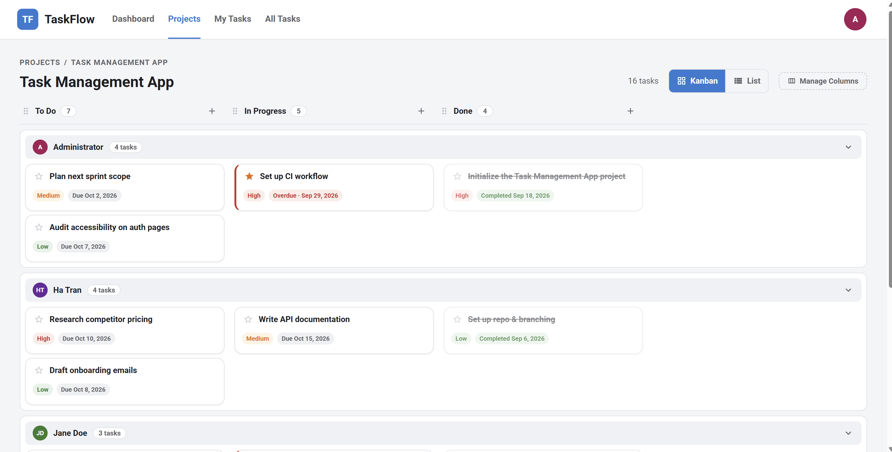
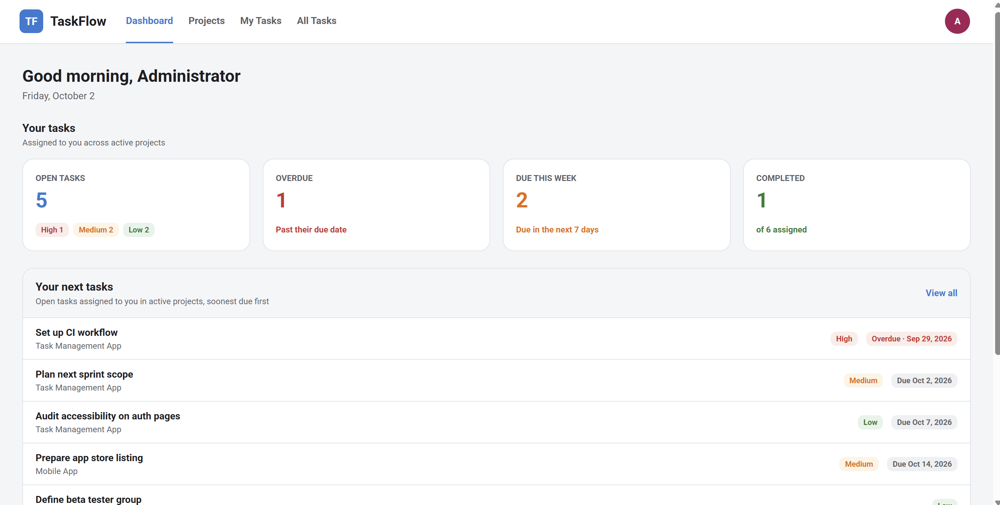
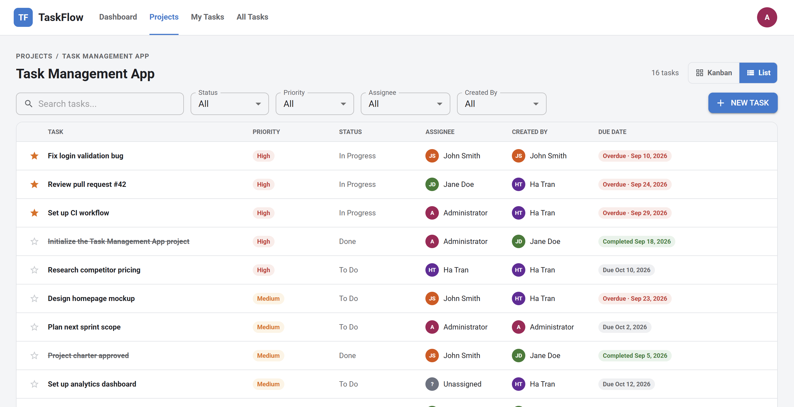
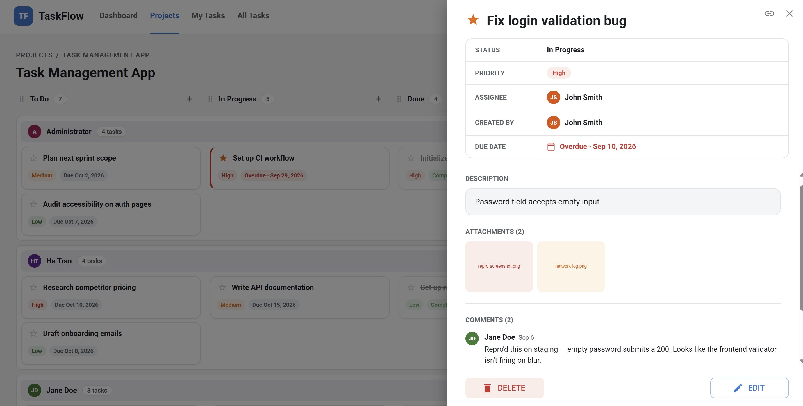
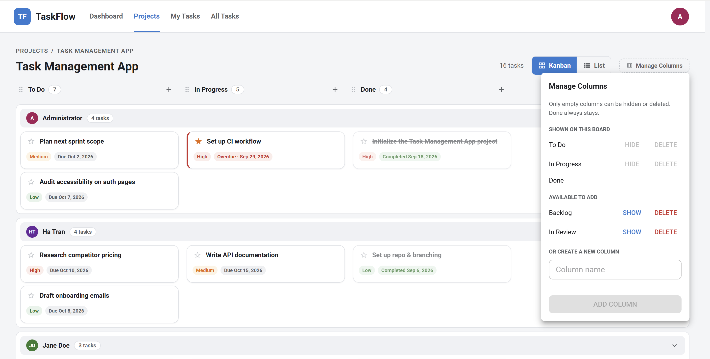
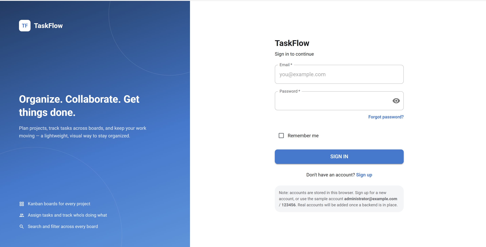

# TaskFlow

[](https://github.com/rautiato/taskflow/actions/workflows/client-ci.yml)

A lightweight, Jira-style project and task management app built with React and TypeScript.

**Live demo:** https://taskflow-hatran.vercel.app (sign in with one of the
[sample accounts](#quick-start)). Data is saved in your browser only.



<details>
<summary>More screenshots</summary>

| Dashboard                                          | Task list                                              |
| -------------------------------------------------- | ------------------------------------------------------ |
|        |            |
| **Task details**                                   | **Manage columns**                                     |
|  |  |
| **Sign in**                                        |                                                        |
|            |                                                        |

</details>

## Features

- **Kanban boards**: one board per project, with assignee swimlanes and drag-and-drop between status columns
- **Column management**: add, reorder, hide and delete each project's status columns
- **Board and list views**: switch any project between Kanban and a sortable, filterable table
- **Task details**: priority, assignee, due date and favorites, plus comments and image attachments
- **My Tasks and All Tasks**: list views across every project, with search, filters and sorting
- **Dashboard**: your open, overdue, due-this-week and completed tasks, plus what to work on next
- **Projects**: create, search and filter projects, and close them when they're done
- **Accounts**: sign up, sign in, password reset flow, profile with avatar upload and crop, and password change

## Tech stack

| Area    | Tools                                                |
| ------- | ---------------------------------------------------- |
| UI      | React 19, TypeScript, Material UI, @hello-pangea/dnd |
| State   | TanStack Query                                       |
| Forms   | React Hook Form, Zod                                 |
| Routing | React Router                                         |
| Testing | Jest, React Testing Library, Playwright              |
| Tooling | Vite, ESLint, Prettier, GitHub Actions               |

## Repository layout

| Folder    | What it is                  | Status      |
| --------- | --------------------------- | ----------- |
| `client/` | React + TypeScript frontend | Working     |
| `server/` | Backend API                 | Not started |

The frontend currently stores everything in the browser's `localStorage`,
so it runs on its own with no server.

## Quick start

Prerequisites: [Node.js](https://nodejs.org/) 22 and [Yarn](https://classic.yarnpkg.com/).

```bash
git clone https://github.com/rautiato/taskflow.git
cd taskflow/client
yarn install
yarn dev
```

Then open the URL Vite prints (usually http://localhost:5173) and sign in with
a sample account (password `123456`):

- `administrator@example.com`
- `jane@example.com`
- `john@example.com`

## Testing

- **Unit and component tests** (Jest + React Testing Library) live next to the
  code they test as `*.test.ts(x)`.
- **End-to-end tests** (Playwright) live in `client/e2e/` and cover signing in,
  projects, task create/edit/delete, drag and drop, and search.
- **CI** runs formatting, lint, build, unit tests and E2E tests on every pull
  request. Unit tests run in a UTC+7 timezone to catch date bugs that don't
  show up in UTC.

Run them from `client/`:

```bash
yarn test:unit
npx playwright install chromium   # first E2E run only
yarn test:e2e
```

More frontend detail (all scripts, project structure, conventions) is in
[client/README.md](client/README.md).

## Deployment

The frontend is deployed on [Vercel](https://vercel.com/) from `client/`:

- Every merge to `master` deploys to production.
- Every pull request gets its own preview deployment.
- [client/vercel.json](client/vercel.json) sends all routes to `index.html`
  so React Router can handle them.

---

Jira is a trademark of Atlassian. TaskFlow is an independent project and is
not affiliated with or endorsed by Atlassian.
